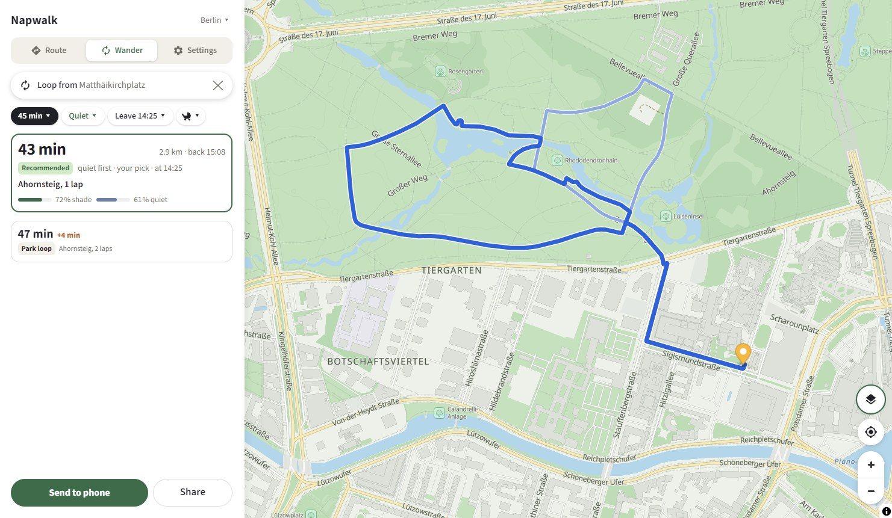

<div align="center">

# Napwalk

### [**napwalk.com**](https://napwalk.com)

Shade, quiet, no cobbles under the stroller or your feet.
On the right side of the street.



</div>

---

## What it does

Pick where you are going, or how long you want to walk, and Napwalk draws a
route that stays in the shade at the time you leave, keeps away from traffic
noise, and prefers surfaces a stroller rolls over without a bump. Three
answers come back: the recommended walk and two alternatives that differ
the most, one faster, one shadier or quieter. A loop mode does the same
from where you stand, by duration.

Eight cities: Frankfurt, Hamburg, Berlin, Munich, Paris, London, New York,
San Francisco.

## How it works

- **Shade is computed, not guessed.** For every walkable metre the city's
  surface model (buildings and trees) is ray-marched against the sun's
  position for each hour of the day. The result is a shade fraction per
  street segment per hour, shipped as a set of time bands.
- **Both sides of the street are separate ways.** Sidewalks are kept as
  their own edges with their own shade, so at two in the afternoon the
  route crosses to the shaded pavement and says so, instead of treating a
  street as one line down the middle.
- **Noise** comes from the cities' published road- and rail-noise maps.
- **Surface** comes from OpenStreetMap tags: surface, smoothness, steps,
  cobbles, informal paths.
- **Routing runs in the browser.** The app downloads a precomputed weighted
  graph for the city and searches it locally. Every edge is priced at the
  time you will actually reach it, not the time you leave. There is no
  routing server.
- The map is a self-hosted vector basemap with the walk's shade drawn over
  it, and a day scrubber to watch the shadows move.

## Stack

Batch pipeline in Python (osmnx, rasterio, numpy, shapely, astral) produces
the graph and the shade bands. The app is Vite, React and TypeScript with
MapLibre GL and PMTiles, deployed as a static site. `web/` is the app,
`pipeline/` the batch, `scripts/` the two asset helpers.

## Running it

```
cd web
npm install
npm run dev
```

The city graphs and basemaps are build artifacts and are not in this
repository; the dev server expects them under `web/public/`.

## Rebuilding the data

Every stage in `pipeline/` is a numbered script that reads `CITY` from the
environment, is idempotent, and checks its own output before it exits.
Python 3.12, `pip install -r pipeline/requirements.txt`.

```
CITY=frankfurt python pipeline/01_build_graph.py      # OSM pedestrian graph, sidewalks as their own edges
CITY=frankfurt python pipeline/03_fetch_noise.py      # the city's noise map
CITY=frankfurt python pipeline/05_build_dsm.py        # surface model from the city's height data
CITY=frankfurt python pipeline/06_surface_cost.py     # surface, cobbles, steps, informal paths
CITY=frankfurt python pipeline/07_noise_cost.py
CITY=frankfurt python pipeline/10_sun_shade.py        # ray-marched shade per edge per hour
CITY=frankfurt python pipeline/08_export_graph.py     # the graph core and its shade bands
CITY=frankfurt python pipeline/16_shade_fraction_tiles.py
CITY=frankfurt python pipeline/17_render_noise.py     # the two map overlays
CITY=frankfurt python pipeline/21_basemap_extract.py  # the vector basemap, cut from the Protomaps planet
powershell -File scripts/basemap-assets.ps1           # sprites and glyphs, once
powershell -File scripts/sync-artifacts.ps1           # mirror everything into web/public
```

The raw inputs are the cities' own open data: a surface model (a DSM from
the state survey, or LiDAR for San Francisco), the official road- and
rail-noise map, and OpenStreetMap through osmnx. `pipeline/cities.py` names
the source and survey year for each of the eight cities; each fetch stage
says in its header where its file comes from and how to get it.
